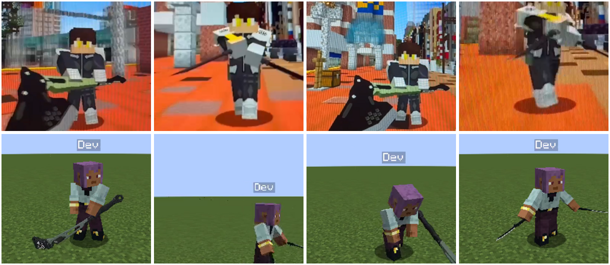

# 0.5.0-D6: animações do machado e das espadas pelos vídeos do Miguel

Referências: `docs/referencias_video/referencia_1.mp4` (espadas duplas, 22 s) e `referencia_2.mp4` (machado, 17 s).
Os dois foram enviados pelo GitHub em `docs/`. Ao renomear pelo editor do GitHub, viraram arquivos de texto vazios
(`docs/referencia 1`, `docs/referencia 2`). Os originais foram recuperados do commit de upload (`1e7baae`).

Colunas da imagem:
1. Machado parado: cabeça do machado no chão, à frente e à direita.
2. Espadas andando: mãos baixas à frente, lâminas para fora.
3. Machado baixo. No vídeo, depois de um golpe; no jogo, no fim do golpe pesado.
4. Espadas paradas (no vídeo, agachado em movimento).

## O que os vídeos mostram

**Referência 2 (machado grande):**
- **Saque:** o machado sai da mão direita, sobe atravessado na altura do peito (cabeça à direita) e desce para a
  guarda.
- **Guarda parada:** a cabeça do machado fica no chão, à frente e à direita, e o cabo sobe na diagonal até a mão
  direita.
- **Andando:** o machado vai com uma mão só, apontando para baixo e à frente, com a cabeça arrastando.
- **Golpes:**
  - varrida baixa da direita para a esquerda, com a cabeça rente ao chão e o corpo girando;
  - varrida atravessada na altura do peito, terminando com o machado do lado esquerdo;
  - machado erguido na vertical e descendo.
- **Corrida:** o vídeo não mostra o personagem correndo com o machado.

**Referência 1 (espadas duplas, estilo Hoshina):**
- **Correndo:** bem agachado e inclinado, braços para trás, lâminas coladas no antebraço.
- **Andando (de frente):** mãos baixas à frente do corpo e lâminas saindo dos punhos para fora, um pouco para baixo
  (pegada invertida).
- **Parado e em combate (de costas):** braços bem abertos para os lados, lâminas para fora.
- **Golpes:**
  - cortes alternando as mãos;
  - giro inteiro com os braços abertos;
  - X agachado;
  - avanço de lado (corpo de perfil) com o braço direito esticado para o alvo.
- **Troca de arma:** aos ~9 s o jogador passa pela barra de itens ("Battle Axe", "Exam Letter", "Husk Spawn Egg").
  É uma troca de item comum, sem animação própria de guardar a arma.

**Limitação:** os vídeos foram gravados com o celular apontado para a tela. Com essa qualidade não dá para ver o
ângulo exato de cada punho nem a ordem completa de um combo longo. Os golpes seguem o que dá para ver; os ângulos
foram acertados comparando os renders do Blockbench com os quadros do vídeo.

## O que mudou

### Machado (`player.two_handed_axe.*`)

| Animação | Antes | Agora |
|---|---|---|
| `stance` (parado) | atravessado no peito | guarda baixa: cabeça no chão, à frente e à direita (`AXE_LOW`) |
| `stance_move` (andando) | igual ao parado | uma mão, cabeça arrastando à frente; braço esquerdo balança |
| `stance_run` (correndo) | uma mão, arrastando atrás | sem mudança (o vídeo não mostra corrida) |
| `draw` (saque) | da cintura direto para a postura | sobe atravessado no peito (`draw_via`) e desce para a guarda |
| `light_1` | varrida horizontal no peito | varrida baixa, da direita para a esquerda, rente ao chão |
| `light_2` | golpe de cima para baixo | varrida atravessada no peito, terminando à esquerda |
| `heavy` | o `light_2` mais amplo | erguido sobre o ombro direito e descendo até o chão à frente (`HEAVIES`) |

### Espadas (`player.dual_reverse.*`, só o jogador)

| Animação | Antes | Agora |
|---|---|---|
| `stance` (parado) | agachado, braços para trás, lâminas escondidas no antebraço | meio agachado, braços abertos, lâminas para fora (`BLADE_OUT`) |
| `stance_move` (andando) | braços abertos para baixo, lâminas no antebraço | mãos baixas à frente, lâminas para fora |
| `stance_run` (correndo) | agachado, braços para trás | sem mudança (já batia com o vídeo) |
| `light_1`, `light_2` | cortes alternados | iguais, com o passo da perna do lado que corta |
| `light_3` | meio giro que desenrolava de volta | giro inteiro de 360° no mesmo sentido (`spin`) |
| `light_4` | X agachado | sem mudança |
| `heavy` | o X mais amplo | avanço de lado com estocada da lâmina direita (`HEAVIES`) |

Os golpes continuam com o tempo do JSON da arma. O dano sai no tick de impacto do servidor (regra 6): preparo, impacto,
continuação, e a recuperação volta à postura.

### Transições e estados (Java)

- **`PlayerAnimations.onClientTick`:** a troca entre parado, andando, correndo e entre armas agora passa pela
  `replaceAnimationWithFade` da Player Animation Library. A pose atual se mistura com a nova em
  `stanceFadeTicks` (5 ticks por padrão, config do cliente). Antes era um corte seco.
- **Morte e espectador:** morto, morrendo ou espectador fica sem postura. A morte não fica por baixo de uma postura
  de corrida.
- **Troca de arma:** já existia e continua igual (`WeaponHandling.onSwitch`, servidor):
  - cancela o golpe ou a recarga em andamento (o golpe não sai com a arma guardada);
  - toca o `draw` da arma nova;
  - a postura é escolhida pelo item na mão de cada cliente, então a do machado e a das espadas nunca valem juntas e
    a arma não aparece duplicada.
- **Prioridade:** a camada de combate (2000) fica acima da postura (1500). O golpe não é trocado pela caminhada;
  quando ele acaba, a postura de baixo aparece.

### O que não foi feito

- **Animação de guardar a arma (`unequip`):** o vanilla troca o item na mão no mesmo tick em que o jogador muda de
  slot. Mostrar a arma antiga sendo guardada exigiria atrasar a troca do inventário, uma mudança de sistema que não
  foi pedida. A transição fica: corte suave da postura antiga, mais o saque da arma nova.
- **Hoshina NPC:** continua com as posturas aprovadas antes (`HOSHINA_NPC_DUAL` no `gen_player_animations.py`, lido
  pelo `gen_hoshina_animations.py`). O arquivo de animação dele saiu byte a byte igual. **[DECIDIR]** se o NPC
  também passa a usar as lâminas para fora do vídeo.

## Modelos, pivôs e texturas

- **Formato:** o jogo não usa `.bbmodel`.
  - Machado e espada são OBJ (`neoforge:obj`, textura 512) com o display da mão; o pivô da pegada é o
    `grip_from_tip`.
  - O jogador é animado pela PAL nos ossos do vanilla.
  - Os `.bbmodel` existem só como modelos-base para o Miguel animar (`tools/blockbench`), e os geradores os leem de
    volta.
- **Auditoria de texturas:** `tools/art/audit_textures.py` rodou nesta etapa e não achou nenhum problema: UV, faces e
  tamanhos ok em todas as entidades e armas.
- **Posição das armas:** conferida pelo render do Blockbench (mesma conta da mão do jogo, ida e volta exata) e em
  jogo:
  - as duas lâminas acompanham os punhos;
  - o machado fica preso à mão direita em todas as animações;
  - nada fica deslocado ao trocar de arma.
- **Ajustes:** só nas rotações e deslizes da arma dentro das próprias animações (`right_item`/`left_item`). Nenhum
  deslocamento solto no código de render.

## Testes

| Teste | Resultado |
|---|---|
| Compilação + JUnit (`gradle build`) | passou |
| GameTests (`runGameTestServer`) | 90/90 |
| Hoshina NPC | `hoshina.animation.json` idêntico ao de antes |
| Render no Blockbench | postura, andar, saque, golpes leves e pesado das duas armas, de frente, de lado e de costas |
| Em jogo: servidor dedicado + 2 clientes (Dev faz, Dev2 filma) | ver abaixo |

**Machado em jogo:**
- guarda parada;
- andando com uma mão;
- correndo;
- `light_1` e `light_2` (varrem da direita para a esquerda);
- pesado (erguido e para baixo);
- troca para as espadas (saque, lâminas para fora, sem duplicar).

**Espadas em jogo:**
- parado;
- andando;
- correndo, com a transição suave para a corrida;
- combo de 4 com o giro;
- pesado (estocada de perfil);
- troca para o machado (sobe atravessado e baixa para a guarda);
- morte sem postura.

**Logs:** sem erro de modelo, textura ou animação. Só o aviso de autenticação offline.

## Como testar em jogo

1. `./gradlew runServer`, `runClient` e `runClient2`.
2. `/give @s kn8:axe`; `/give @s kn8:hoshina_sword 2` (uma na mão principal, outra na secundária).
3. Com o machado:
   - parado, andando (W) e correndo (Ctrl+W);
   - clique esquerdo duas vezes (combo);
   - segure e solte o clique direito (pesado).
4. Troque para as espadas pela barra:
   - o saque toca e a postura muda sem corte seco;
   - repita parado, andando e correndo;
   - quatro cliques (combo com o giro no 3º);
   - pesado.
5. Do outro cliente, confira que o Dev2 vê as mesmas posturas e golpes.
6. Para mudar o tempo da transição: `config/kn8-client.toml`, `[fx] stanceFadeTicks` (0 desliga).

## Ajustes manuais no Blockbench

Os modelos-base (`python3 tools/art/blockbench_templates.py gerar`) já saem com as animações novas. Os ângulos finos
de cada golpe podem ser refinados lá pelo Miguel (`docs/BLOCKBENCH_ANIMACOES.md`), principalmente:
- o giro do `light_3`;
- a estocada do `heavy` das espadas.
