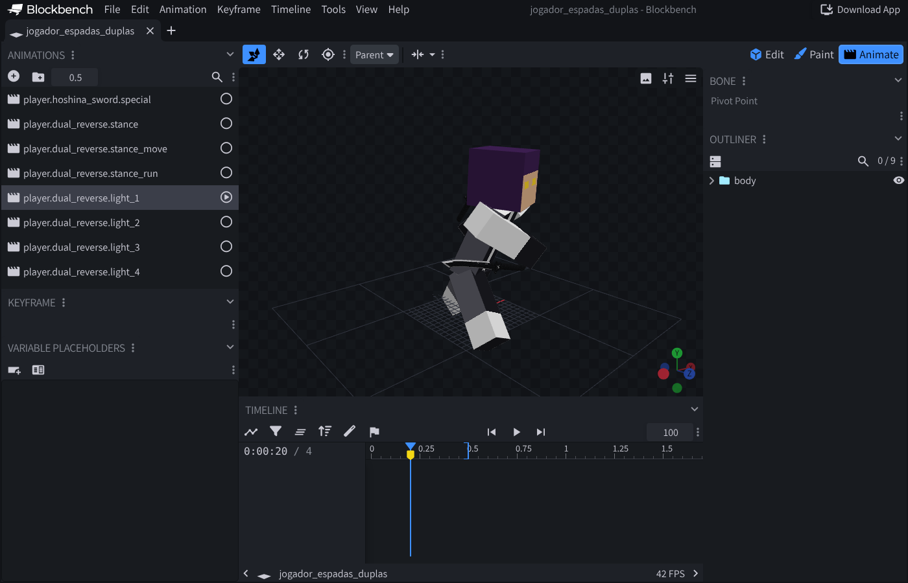

# Animando no Blockbench (0.5.0-D5)

Guia do Miguel para animar o jogador e o Hoshina no Blockbench. O Claude gera os modelos-base, você anima e manda
o arquivo, e o Claude coloca no jogo.

## Os arquivos

| Arquivo | O que é | Animações dentro |
|---|---|---|
| `jogador_espadas_duplas.bbmodel` | Jogador com uma espada do Hoshina em cada mão | parado, andando, correndo, combo 1–4, pesado, especial (Kūuchi), saque, guarda |
| `jogador_machado.bbmodel` | Jogador com o machado da Kikoru | parado, andando, correndo, combo 1–2, pesado, especial (Axe Slam), saque, guarda |
| `hoshina.bbmodel` | O Hoshina NPC (modelo do jogo) com as duas espadas | parado, andando, correndo, golpe comum e as técnicas (Kūuchi, Kōsa-uchi, Ran-uchi, Kasumi-uchi, Yae-uchi, Kaeshi-uchi, esquiva, aparar) |

Cada arquivo já vem com as animações que estão hoje no jogo. Você só corrige o que estiver errado.

O que cada nome quer dizer:

| Nome | Quando toca no jogo |
|---|---|
| `stance` / `hoshina.parado` | parado com a arma na mão (em laço) |
| `stance_move` / `hoshina.andando` | andando (em laço) |
| `stance_run` / `hoshina.correndo` | correndo (em laço) |
| `light_1`, `light_2`… | cada golpe do combo (clique) |
| `heavy` | golpe pesado |
| `special` | ataque especial (tecla R) |
| `draw` | sacar a arma |
| `guard` | guarda (segura a última pose enquanto bloqueia) |
| `hoshina.action.<técnica>` | cada técnica do Hoshina |

## Passo a passo

1. **Abrir o Blockbench.** Pode ser o programa (blockbench.net, botão Download) ou o site web.blockbench.net.
2. **Abrir o arquivo:** `File` → `Open Model` → escolha o `.bbmodel`.
3. **Ir para a aba de animação:** botão **Animate**, no canto de cima à direita.
4. **Escolher a animação** na lista **Animations**, à esquerda. Aperte **espaço** para tocar e de novo para parar.
5. **Mudar uma pose:**
   - leve a linha azul da **Timeline** (embaixo) até o tempo que quer mudar;
   - clique na parte do corpo (ou no nome dela na lista **Outliner**, à direita);
   - com a ferramenta de girar (atalho **R**), arraste os anéis coloridos. O Blockbench cria o quadro-chave sozinho;
   - para subir ou descer o corpo inteiro, use a ferramenta de mover (atalho **V**) só no osso `body` (jogador) ou `root` (Hoshina).
6. **Salvar:** `File` → `Save Model` (**Ctrl+S**). Mande o arquivo `.bbmodel` salvo.

## Os ossos

**Jogador:** `body` (gira e desce o corpo inteiro em volta do quadril; use para inclinar o corpo), `torso`, `head`,
`right_arm`, `left_arm`, `right_leg`, `left_leg`, `right_item` e `left_item`.

**Hoshina:** `root` (desce o corpo inteiro), `body` (tronco), `head`, `arm_right`, `arm_left`, `leg_right`,
`leg_left`, `item_right` e `item_left`.

**Espadas e machado:** a arma está presa no osso `right_item` / `left_item` (no Hoshina `item_right` / `item_left`).
- Para mudar como a arma fica na mão (pegada invertida, ângulo da lâmina), gire esse osso. Ele gira em volta do
  ponto que o jogo usa, então o que você vê é o que vai aparecer no jogo.
- Não arraste a malha da arma em si, só o osso.

## Marcas amarelas = momento do dano

Nos golpes (combo, pesado, especial, técnicas) há marcas amarelas na Timeline. Elas mostram o instante em que o
servidor aplica o dano. O golpe tem que **acertar na marca**: a lâmina passa pelo alvo ali. Antes dela é a
preparação, depois a volta.

## Pode e não pode

**Pode:**
- mudar qualquer pose e quadro-chave;
- acrescentar quadros-chave;
- criar uma animação nova (me diga o nome e quando ela deve tocar).

**Não pode, ou me avise antes:**
- **não renomear os ossos nem as animações**: é pelo nome que o jogo encontra cada uma;
- **não mexer na aba Edit** (mover peças, pivôs ou o modelo): o jogo usa o modelo dele, não o do arquivo;
- **não mudar a duração** dos golpes sem me avisar: o tempo vem do servidor;
- deixe **Linear** como interpolação (clique com o botão direito no quadro-chave → Interpolation). As outras ainda
  não foram testadas no jogo.

## Cuidados para as espadas não saírem da mão

Estes três casos apareceram no seu `hoshina.bbmodel` (2026-10-09). Antes e depois:
`img/hoshina_espadas_antes_depois.png`.

1. **Pose nova em todos os keyframes do laço.**
   - Parado, andando e correndo repetem sem parar.
   - Se a pose nova fica só em 0,65 e os keyframes 1 e 2 continuam com a pose antiga, o Hoshina vai e volta entre
     as duas, e as espadas giram junto.
   - Ao mudar a pose, mude também os keyframes 0, 1 e 2. O começo e o fim do laço têm que ser iguais.
2. **Cuidado com números como -328.**
   - Arrastando o anel de giro, o Blockbench pode gravar -328 em vez de 32. É a mesma pose naquele instante, mas no
     meio do caminho o braço dá uma volta inteira, e a espada atravessa o corpo.
   - Se um número de rotação passar de 180 ou de -180, confira.
3. **Espada nas técnicas.**
   - Nas técnicas (`hoshina.action.*`), o jogo deixa a espada na rotação e na posição da postura.
   - O modelo-base já vem com isso no tempo 0. Não precisa compensar a posição.
   - Para a espada fazer algo diferente numa técnica, mude a rotação dela ali.

O Claude corrige os dois primeiros casos sem apagar nada com `python3 tools/blockbench/corrigir_poses.py`.

## Ordem sugerida

1. `jogador_espadas_duplas`: parado, andando e correndo (`stance`, `stance_move`, `stance_run`).
2. `jogador_machado`: as mesmas três.
3. `hoshina`: `hoshina.parado`, `hoshina.andando`, `hoshina.correndo`.
4. Depois os golpes e as técnicas.

## O que o Claude faz com o arquivo que você manda

1. Coloca o `.bbmodel` em `tools/blockbench/animacoes/`.
2. Roda `python3 tools/art/gen_player_animations.py` e `python3 tools/art/gen_hoshina_animations.py hoshina`.
   O que veio do Blockbench vale por cima do que os scripts geram, e o resto continua igual.
3. Confere se os golpes batem nas marcas e testa em jogo com 2 clientes.

**Detalhes técnicos** (para o Claude):
- Modelos-base: `python3 tools/art/blockbench_templates.py gerar <pasta>`, depois
  `node tools/blockbench/run.js tools/blockbench/build.js <pasta>/<modelo>.json`. Esse passo monta o projeto dentro
  do Blockbench web, com Playwright.
- Conversão de eixos e da pegada da arma: comentários no topo de `blockbench_templates.py`. A ida e volta foi
  conferida: 1.528 quadros-chave do jogador e 560 do Hoshina saem idênticos.
